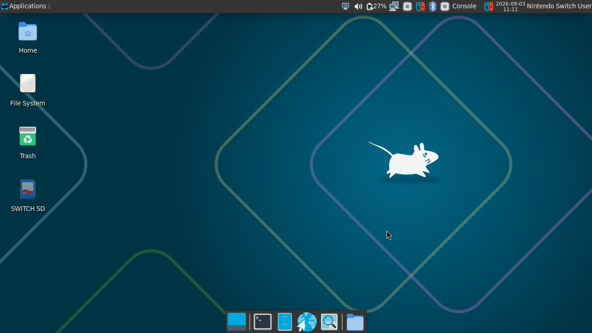

# Switchroot Debian 13 (Trixie) for Nintendo Switch

[](https://github.com/CarlosGamer98YT/Debian-4-Xitch/actions/workflows/release.yml)
[-crimson.svg)](https://www.debian.org/)
[](https://developer.nvidia.com/embedded/linux-tegra)
[](https://wiki.debian.org/Arm64Port)

A complete GNU/Linux distribution based on **Debian 13 (Trixie)** for the Nintendo Switch (V1, V2, Lite, and OLED models). Engineered with native hardware acceleration, modern BlueZ support, instantaneous display rotation, power management, battery health protection, and streamlined Hekate Nyx installer packaging.

---

<p align="center">
  
</p>

---

## Key Features

* **Debian 13 (Trixie) Base**: Up-to-date modern package repositories with long-term stability and security.
* **NVIDIA Tegra X1 Hardware Acceleration**:
  - Integrated with proprietary NVIDIA Tegra 32.3.1 drivers (`nvidia_drv.so`).
  - Custom Xorg 1.20.13 (ABI 24.1) server ensuring zero ABI mismatch crashes and full 2D/3D hardware rendering.
* **Instantaneous Screen & Touch Rotation**:
  - `switch-rotate` command-line and panel launcher.
  - Dynamically rotates both display output (`xrandr`) and touchscreen coordinates (`xinput` transformation matrix) in real time without requiring a system reboot.
* **Kernel 4.9.140-l4t+ with Modern BlueZ Backports**:
  - Backported Linux kernel Bluetooth Management opcodes (`MGMT_OP_READ_EXP_FEATURES_INFO` and `MGMT_OP_GET_DEVICE_FLAGS`).
  - Full compatibility with modern BlueZ 5.80+ stacks for wireless controllers, audio devices, and accessories.
* **Complete Audio Subsystem**:
  - Fully configured ALSA UCM2 device profiles.
  - PulseAudio per-user daemon supporting internal speakers, 3.5mm headphone jack (with automatic jack detection), and HDMI/DisplayPort audio out.
* **NVPModel Overclock & Battery Charging Protection**:
  - Top panel status indicators for CPU, GPU, and EMC memory clock profiles.
  - Configurable fan profiles (Quiet, Cool, Balanced).
  - Battery charge threshold protection (50% to 100%) to extend battery lifespan during prolonged docked use.
* **Desktop Environment & Layout**:
  - Lightweight XFCE4 desktop with a clean, clutter-free desktop area.
  - Top status panel featuring NetworkManager (WiFi), Blueman (Bluetooth), Audio volume, Battery level, and NVPModel indicators.
  - Bottom quick-launch dock with Show Desktop, Web Browser (Firefox ESR), Terminal (XFCE Terminal), File Manager (Thunar), and Application Finder.
* **Hekate Nyx Split Installer (`l4t.00` & `l4t.01`)**:
  - FAT32-safe 4 MiB-aligned ext4 disk images compatible with the Hekate Nyx Partition Manager.
  - Automatic partition expansion on first boot via `initramfs` and `resize2fs`.

---

## Hardware Support

| Model | Supported | 8gb RAM | Notes |
| :--- | :---: | :--- |
| **Nintendo Switch V1 (Erista)** | Yes | Yes | RCM exploit or modchip |
| **Nintendo Switch V2 (Mariko)** | Yes | Yes | Modchip required |
| **Nintendo Switch Lite** | Yes | Yes | Modchip required |
| **Nintendo Switch OLED** | Yes | Yes | Modchip required |

---

## Quick Installation Guide (Hekate Nyx)

### 1. Partitioning the MicroSD Card
1. Boot your Nintendo Switch into **Hekate**.
2. Tap **Tools** -> **Partition SD Card**.
3. Move the **Linux** slider to allocate space for Debian (minimum: **8 GB**, recommended: **16 GB** or more).
4. Tap **Next Step** and proceed to format the SD card.

### 2. Copying Installer Files
1. Download the latest **`switch-debian-13-trixie-xfce4-installer-hekate.zip`** from the [Releases](https://github.com/carlos/switch-debian-trixie/releases) page.
2. Extract the archive directly onto the root of your MicroSD card's FAT32 partition.
   - The directory tree should contain `bootloader/`, `switchroot/debian/`, and `switchroot/install/l4t.00`, `l4t.01`.

### 3. Flashing & First Boot
1. Insert the MicroSD card into your Nintendo Switch and power on into Hekate.
2. Navigate to **Tools** -> **Partition SD Card** -> **Flash Linux**.
3. Hekate will verify the checksums and flash `l4t.00` and `l4t.01` into your ext4 partition.
4. Once completed, return to the Hekate main menu, tap **More Configs**, and select **Debian 13 (Trixie)**.
5. On the first boot, the system will automatically resize the ext4 filesystem to fill the entire allocated space.

---

## Default System Credentials

| User | Password | Sudo Privileges | Notes |
| :--- | :--- | :---: | :--- |
| **`switch`** | `switch` | Yes (passwordless `sudo`) | Default user account |
| **`root`** | *Locked / Disabled* | Direct login disabled | Use `sudo -i` or `sudo <command>` |

---

## Controls & Usage

* **WiFi**: Click the WiFi applet on the top panel or launch **Escáner de Redes WiFi** from the application menu.
* **Bluetooth**: Click the Bluetooth icon on the top panel to pair wireless controllers or audio headsets.
* **Screen Rotation**: Tap the rotation icon in the top panel or execute:
  ```bash
  switch-rotate landscape
  switch-rotate portrait
  switch-rotate inverted_landscape
  switch-rotate inverted_portrait
  ```
* **Performance / Overclock**: Click the NVPModel icon in the top panel to select clock speeds or toggle battery charging limits.

---

## Building from Source

### Prerequisites (Debian/Ubuntu Host)
Run the automated prerequisite installer:
```bash
sudo ./autoinstall_prerequisites.sh
```

Or install required dependencies manually:
```bash
sudo apt-get update && sudo apt-get install -y \
  debootstrap qemu-user-static binfmt-support \
  build-essential gcc-aarch64-linux-gnu g++-aarch64-linux-gnu \
  u-boot-tools libssl-dev bc bison flex zip e2fsprogs imagemagick
```

### 1. Build RootFS and Boot Assets
```bash
sudo ./build.sh
```
This builds the kernel, generates device tree images (`nx-plat.dtimg`), compiles `uImage`, bootstraps Debian 13 (Trixie), configures XFCE4, and places artifacts into `build_output/`.

### 2. Create the Split Hekate Installer
```bash
./pack_l4t_installer.sh
```
This converts `build_output/rootfs` into an ext4 image (`SWR-DEB`), splits it into 4 MiB-aligned chunks (`l4t.00` and `l4t.01`), and archives everything into `switch-debian-13-trixie-xfce4-installer-hekate.zip`.

---

## License & Credits

* **Debian GNU/Linux**: [Software in the Public Interest, Inc.](https://www.debian.org/)
* **Switchroot Team**: For foundational device tree trees, bootloaders, and L4T patches.
* **CTCaer & contributors**: For Hekate, Nyx, and partition management tools.
* **NVIDIA**: For Linux for Tegra (L4T) board support packages and drivers.
